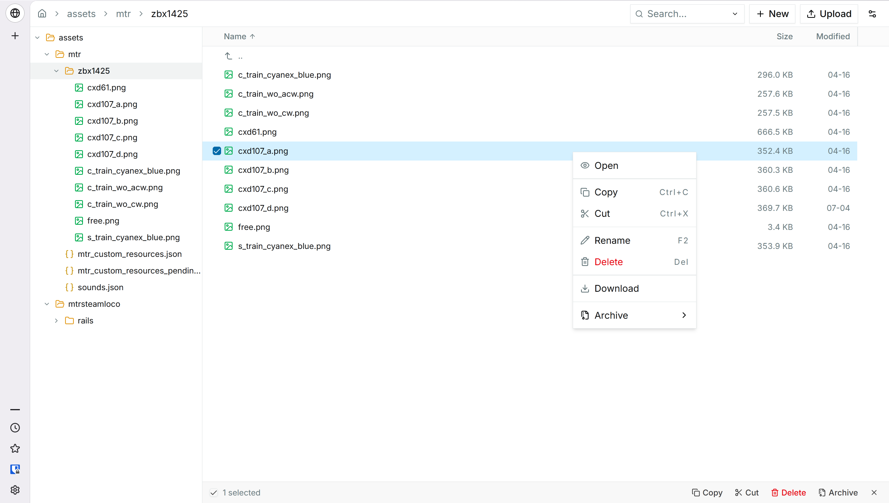
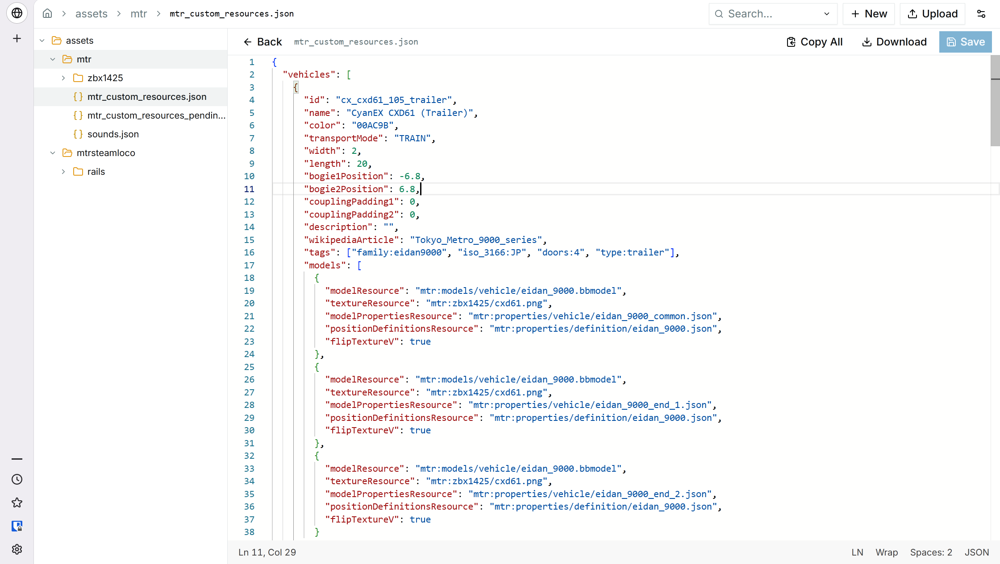

# 📦 FileCarton

> A modern, snappy, and easily embeddable web-based file manager.

**FileCarton** is a lightweight PHP web file manager, designed for self-hosting and integration into other applications.  
**FileCarton** can be useful to you if you need a drop-in file manager script, or want to embed file management capabilities into your own project without reinventing the wheel.

**FileCarton** is deeply inspired by the incredible work of [TinyFileManager (TFM)](https://github.com/prasathmani/tinyfilemanager), and *aims* to be a modern alternative to it.

## ✨ Why FileCarton?

*   🚀 **SPA Experience**: By packing a decoupled frontend and backend architecture into a single file, FileCarton has a snappy user experience without page reloads.
*   🧩 **Built to Embed**: Easily embed and integrate FileCarton into your existing logic or custom dashboards with minimal configuration.
*   🛠️ **Effortless Deployment**: Simple to set up and highly configurable.
*   💅 **Sleek & Modern UI**: A clean interface with careful thought to make common operations intuitive.
*   📝 **Monaco Editor Integration**: Features the Monaco Editor (the one behind VS Code) for a better code and text editing experience in your browser.
*   ⚖️ **MIT Licensed**: You can freely embed it into your projects.
