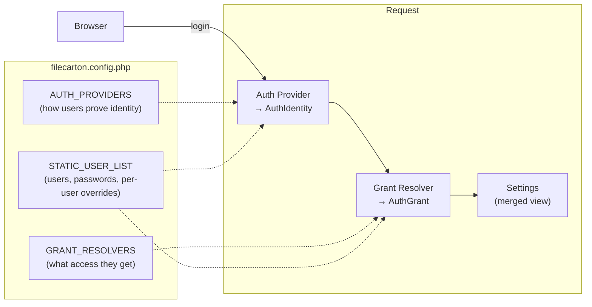

# Configuring authentication

FileCarton has a built-in auth system.  
If you are to embed FileCarton in your own application, you're likely already handling authentication in other parts of your app and does not FileCarton to handle it, in which case you should see [embedding.md](embedding.md) instead.

## TLDR

To configure password login with optionally per-user directories:

```php
define_default('FILECARTON_STATIC_USER_LIST', [
    ['id' => 'alice', 'passwordHash' => '$2y$10$...'],
    ['id' => 'bob', 'passwordHash' => '$2y$10$...', 'root' => '/srv/files/bob'],
    ['id' => 'charlie', 'passwordHash' => '$2y$10$...', 'root' => '/srv/files/charlie', 'readonly' => true],
]);

define_default('FILECARTON_AUTH_PROVIDERS', [
    ['class' => \FileCarton\StaticPasswordAuth::class],
]);
```

Generate hashes with `php -r "echo password_hash('the-password', PASSWORD_DEFAULT), PHP_EOL;"`.

Read on for more details on the authentication configuration.

## How it fits together



These parts being:

- **Auth providers** handle login. They accepts password or OAuth requests and produces an `AuthIdentity` (a user ID + display name).
- **Grant resolvers** map user identities to access configurations. Given an identity, they return an `AuthGrant` (which directory to show, read-only or not, etc.). The built-in `StaticGrantResolver` looks up the user's ID in `STATIC_USER_LIST`.
- **`STATIC_USER_LIST`** is the user table used by built-in authentication plugins (`StaticPasswordAuth`, `NoLoginAuth` and `StaticGrantResolver`): an array of rows, each with an `id` and optional fields like password hash, per-user root directory, and display name.

## Open access

The default configuration ships `NoLoginAuth`, which means anyone can access files without logging in.

```php
define_default('FILECARTON_STATIC_USER_LIST', [
    ['id' => 'local'],
]);
define_default('FILECARTON_AUTH_PROVIDERS', [
    ['class' => \FileCarton\NoLoginAuth::class],
]);
```

## Password login

Replace `NoLoginAuth` with `StaticPasswordAuth` and add a `passwordHash` to your user rows:

```php
define_default('FILECARTON_STATIC_USER_LIST', [
    [
        'id'           => 'admin',
        'passwordHash' => '$2y$10$...your.bcrypt.hash.here...',
        'displayName'  => 'Admin',
    ],
]);

define_default('FILECARTON_AUTH_PROVIDERS', [
    ['class' => \FileCarton\StaticPasswordAuth::class],
]);
```

Generate a password hash from the command line:

```bash
php -r "echo password_hash('your-password', PASSWORD_DEFAULT), PHP_EOL;"
```

Paste the output as the `passwordHash` value. Do not store the plaintext password anywhere.

## GitHub OAuth

You can add GitHub login alongside or instead of passwords:

```php
define_default('FILECARTON_STATIC_USER_LIST', [
    ['id' => 'admin', 'passwordHash' => '$2y$10$...'],
    ['id' => 'github:583231'],  // GitHub user
]);

define_default('FILECARTON_AUTH_PROVIDERS', [
    ['class' => \FileCarton\StaticPasswordAuth::class],
    ['class' => \FileCarton\GitHubOAuth::class, 'clientId' => 'Ov23li...', 'clientSecret' => '...'],
]);
```

To set up the GitHub side:

1. Go to GitHub → Settings → Developer settings → OAuth Apps → New OAuth App.
2. Set the authorization callback URL to `https://your-domain.com/filecarton.php?fcauth=callback&plugin=github` (adjust the script path to match your deployment).
3. Copy the Client ID and Client Secret into the config above.

You'll then need to whitelist a list of users that are allowed to use your app by adding them into `FILECARTON_STATIC_USER_LIST`. The `id` for GitHub users is `github:` followed by the user's **numeric GitHub ID** (not the login name). You can find this at `https://api.github.com/users/<username>` (look for the `id` field). 

If the id does not match any row, the user will see "This account is not allowed to log in".

If you want to automatically allow all users from a certain OAuth provider to be granted access, you should write your custom `GrantResolver`. By doing so you can also do fancy things like automatically assigning users their own folder.

If your server is behind a reverse proxy, set `FILECARTON_PUBLIC_ORIGIN` so the OAuth redirect URL is correct:

```php
define_default('FILECARTON_PUBLIC_ORIGIN', 'https://files.example.com');
```

## The user list

Each row in `FILECARTON_STATIC_USER_LIST` is an array with these fields:

| Field | Required | What it does |
|---|---|---|
| `id` | yes | The username for password login (must not contain `:`), or the provider-prefixed ID for OAuth (e.g. `github:583231`). Also used by `StaticGrantResolver` to look up grants. |
| `passwordHash` | no | A `password_hash()` output. If present, `StaticPasswordAuth` will accept this user with the matching password. |
| `displayName` | no | Shown in the toolbar. Defaults to `id`. |
| `root` | no | Overrides `FILECARTON_ROOT_PATH` for this user. Use an absolute path. If the directory does not exist, the user gets a "not configured" error (not a 500 for everyone else). |
| `readonly` | no | `true` forces read-only for this user. Cannot override a global `FILECARTON_READONLY = true` (i.e. you cannot grant write access to a user when the whole instance is read-only). |
| `branding` | no | Overrides `FILECARTON_BRANDING` for this user. An empty string `''` hides the branding. |
| `repoName` | no | Overrides `FILECARTON_REPO_NAME` for this user. |

Example with per-user directories:

```php
define_default('FILECARTON_STATIC_USER_LIST', [
    ['id' => 'alice', 'passwordHash' => '$2y$10$...', 'root' => '/srv/files/alice'],
    ['id' => 'bob',   'passwordHash' => '$2y$10$...', 'root' => '/srv/files/bob', 'readonly' => true],
    ['id' => 'github:583231', 'displayName' => 'octocat', 'root' => '/srv/files/shared'],  // GitHub only
]);
```

## Grant resolvers

The default `StaticGrantResolver` looks up the logged-in user's ID in `STATIC_USER_LIST` (case-insensitive) and returns any `root`/`readonly`/`branding`/`repoName` overrides it finds.

If the static list does not fit your needs (for example, you want to look up user directories from a database), you can write a custom grant resolver. See [auth_provider.md](auth_provider.md) for how to do that.

The `FILECARTON_GRANT_RESOLVERS` array is evaluated in a chain, where each resolver can either returns a grant or passes. The first non-null result is used. If no resolver returns anything, the user is denied access.

```php
define_default('FILECARTON_GRANT_RESOLVERS', [
    ['file' => __DIR__ . '/my_resolver.php', 'class' => \MyApp\DbGrantResolver::class, 'dsn' => '...'],
    ['class' => \FileCarton\StaticGrantResolver::class],  // fallback
]);
```

## Mixing providers

You can combine password and redirect providers. The login page will show a form for passwords and a button for each redirect provider.

`NoLoginAuth` will just skip the login page and thus cannot be combined with other providers.

## Deployment

For production deployments you should **always use HTTPS.**

- If TLS is terminated at a reverse proxy, configure the proxy to send `X-Forwarded-Proto: https` so that FileCarton generates correct OAuth callback URLs.
- Or if that doesn't work, you can set `FILECARTON_PUBLIC_ORIGIN` to your public origin URL (with scheme, without path).

## Session

FileCarton stores login state in the standard PHP session. In standalone mode, the session cookie is named `FILECARTON` by default. When embedding, FileCarton uses the host application's existing session.
