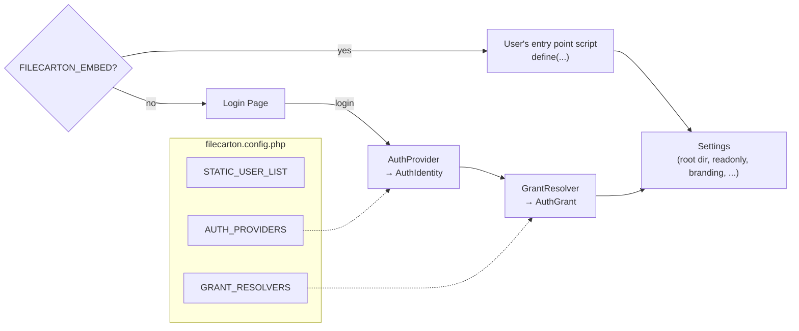

# Configuring authentication

FileCarton has a built-in auth system supporting password or OAuth login.



- **Auth providers** handles password or OAuth login, and produces an `AuthIdentity` (a user ID + display name).
- **Grant resolvers** map `AuthIdentity` to an `AuthGrant` (which directory to show, read-only or not, etc.).
  The built-in `StaticGrantResolver` looks up the user's ID in `STATIC_USER_LIST`.
- **`STATIC_USER_LIST`** is the user table used by built-in authentication plugins (`StaticPasswordAuth`, `NoLoginAuth` and `StaticGrantResolver`).
- If you are to embed FileCarton in your own application, you're likely already handling authentication in other parts of your app. In which case you should see [embedding.md](embedding.md) instead.

## How do I configure FileCarton to use...

### Password login

Use `StaticPasswordAuth` and add a `passwordHash` to your user rows:

```php
define_default('FILECARTON_STATIC_USER_LIST', [
    [
        'id'           => 'admin',
        'displayName'  => 'Admin', // (Optional)
        'passwordHash' => '$2y$10$...your.bcrypt.hash.here...',
        'root'         => __DIR__ . '/folder-for-admin', // (Optional, sets the user's root directory)
    ],
]);

define_default('FILECARTON_AUTH_PROVIDERS', [
    ['class' => \FileCarton\StaticPasswordAuth::class],
]);
```

Generate a password hash from the command line:

```bash
php -r "echo password_hash('your-password', PASSWORD_DEFAULT), PHP_EOL;"
```

Paste the output as the `passwordHash` value. Do not store the plaintext password anywhere.

### OAuth (Github as example)

You can add GitHub login alongside or instead of passwords:

```php
define_default('FILECARTON_STATIC_USER_LIST', [
    ['id' => 'admin', 'passwordHash' => '$2y$10$...'], // Password user
    ['id' => 'github:583231'],  // GitHub user
]);

define_default('FILECARTON_AUTH_PROVIDERS', [
    ['class' => \FileCarton\StaticPasswordAuth::class],
    ['class' => \FileCarton\GitHubOAuth::class, 'clientId' => 'Ov23li...', 'clientSecret' => '...'],
]);
```

The following OAuth providers are built in:

| Class | User ID format | Notes |
|---|---|---|
| `GitHubOAuth` | `github:<numeric id>` | Find the numeric ID at `https://api.github.com/users/<username>` (the `id` field). |
| `MicrosoftOAuth` | `microsoft:<object id>` | Accepts any Microsoft account by default. Pass `'tenant' => 'consumers'` for personal accounts only, or a specific tenant ID for a single org. |
| `GoogleOAuth` | `google:<sub>` | The `sub` is a stable numeric string from Google's OpenID Connect. Find it at the OAuth consent screen or via the userinfo endpoint. |
| `DiscordOAuth` | `discord:<snowflake id>` | The snowflake is the user's numeric ID visible in Discord developer mode. |

All providers accept `clientId` and `clientSecret` in the config array.

You'll need to create an OAuth app on the provider's website and get the client ID and client secret.

You'll need to whitelist users by adding them to `FILECARTON_STATIC_USER_LIST` with the provider-prefixed ID (see the table above).

If the user's ID does not match any row in `FILECARTON_STATIC_USER_LIST`, the user will see "This account is not allowed to log in" along with their account ID (e.g. `github:583231`), which they can forward to the administrator for whitelisting.

If you want to automatically allow all users from a certain OAuth provider to be granted access, you should write your custom `GrantResolver`. By doing so you can also do fancy things like automatically assigning users their own folder.

If your server is behind a reverse proxy, set `FILECARTON_PUBLIC_ORIGIN` so the OAuth redirect URL is correct:

```php
define_default('FILECARTON_PUBLIC_ORIGIN', 'https://files.example.com');
```

### Open access

Anyone can access files without logging in. You need one entry in `FILECARTON_STATIC_USER_LIST` as the default identity.

```php
define_default('FILECARTON_STATIC_USER_LIST', [
    ['id' => 'local'],
]);
define_default('FILECARTON_AUTH_PROVIDERS', [
    ['class' => \FileCarton\NoLoginAuth::class],
]);
```

## The user list

Each row in `FILECARTON_STATIC_USER_LIST` is an array with these fields:

| Field | Required | What it does |
|---|---|---|
| `id` | yes | The username for password login (must not contain `:`), or the provider-prefixed ID for OAuth (e.g. `github:583231`, `google:1234567890`). Also used by `StaticGrantResolver` to look up grants. |
| `passwordHash` | no | A `password_hash()` output. If present, `StaticPasswordAuth` will accept this user with the matching password. |
| `displayName` | no | Shown in the toolbar. Defaults to `id`. |
| `root` | no | Overrides `FILECARTON_ROOT_PATH` for this user. Use an absolute path. If the directory does not exist, the user gets a "not configured" error (not a 500 for everyone else). |
| `readonly` | no | `true` forces read-only for this user. Cannot override a global `FILECARTON_READONLY = true` (i.e. you cannot grant write access to a user when the whole instance is read-only). |
| `branding` | no | Overrides `FILECARTON_BRANDING` for this user. An empty string `''` hides the branding. |
| `repoName` | no | Overrides `FILECARTON_REPO_NAME` for this user. |

Example with per-user directories:

```php
define_default('FILECARTON_STATIC_USER_LIST', [
    ['id' => 'alice', 'passwordHash' => '$2y$10$...', 'root' => '/srv/files/alice'],
    ['id' => 'bob',   'passwordHash' => '$2y$10$...', 'root' => '/srv/files/bob', 'readonly' => true],
    ['id' => 'github:583231', 'displayName' => 'octocat', 'root' => '/srv/files/shared'], 
]);
```

## Grant resolvers

The default `StaticGrantResolver` looks up the logged-in user's ID in `STATIC_USER_LIST` (case-insensitive) and returns any `root`/`readonly`/`branding`/`repoName` overrides it finds.

If the static list does not fit your needs (for example, you want to look up user directories from a database), you can write a custom grant resolver. See [auth_provider.md](auth_provider.md) for how to do that.

The `FILECARTON_GRANT_RESOLVERS` array is evaluated in a chain, where each resolver can either returns a grant or passes. The first non-null result is used. If no resolver returns anything, the user is denied access.

```php
define_default('FILECARTON_GRANT_RESOLVERS', [
    ['file' => __DIR__ . '/my_resolver.php', 'class' => \MyApp\DbGrantResolver::class, 'dsn' => '...'],
    ['class' => \FileCarton\StaticGrantResolver::class],  // If you want fallback
]);
```

## Mixing providers

You can combine password and redirect providers. The login page will show a form for passwords (which is checked against every password auth provider) and a button for each redirect provider.

`NoLoginAuth` will just skip the login page and thus cannot be combined with other providers.

## Deployment

For production deployments you should **always use HTTPS.**

- If TLS is terminated at a reverse proxy, configure the proxy to send `X-Forwarded-Proto: https` so that FileCarton generates correct OAuth callback URLs.
- Or if that doesn't work, you can set `FILECARTON_PUBLIC_ORIGIN` to your public origin URL (with scheme, without path).

## Session

FileCarton stores login state in the standard PHP session. In standalone mode, the session cookie is named `FILECARTON` by default. When embedding, FileCarton uses the host application's existing session.
