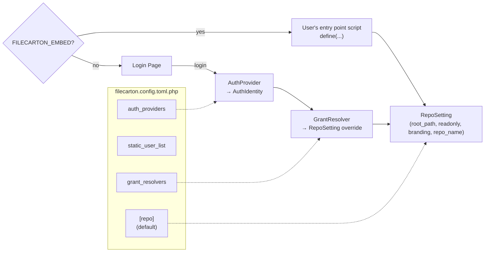

# Configuring authentication

> If you're new here you should start with [getting_started.md](getting_started.md) for a minimal working setup.
> If you want to embed FileCarton in your own app, please see [embedding.md](embedding.md) instead.
> If you want to write a custom auth plugin, please see [auth_provider.md](auth_provider.md).

FileCarton has a built-in auth system supporting password or OAuth login.


```mermaid
flowchart LR
    mode{"FILECARTON_EMBED?"}

    mode -->|"yes"| entry["User's entry point script\ndefine(...)"]
    entry --> repoSetting["RepoSetting\n(root_path, readonly, branding, repo_name)"]

    mode -->|"no"| browser["Login Page"]
    browser -->|"login"| provider["AuthProvider\n→ AuthIdentity"]
    provider --> grant["GrantResolver\n→ RepoSetting override"]
    grant --> repoSetting

    subgraph config ["filecarton.config.toml.php"]
        defaultSetting["[repo]\n(default)"]
        userList["static_user_list"]
        providers["auth_providers"]
        resolvers["grant_resolvers"]
    end

    defaultSetting -.-> repoSetting
    providers -.-> provider
    resolvers -.-> grant
```

- **Auth providers** handle password or OAuth login, and produce an `AuthIdentity` (a user ID + display name).
- **Grant resolvers** map `AuthIdentity` to a `RepoSetting` override (which directory to show, read-only or not, etc.). The override is combined with the default `[repo]` settings (`FILECARTON_REPO_SETTING`) from the config.
  The built-in `StaticGrantResolver` looks up the user's ID in `static_user_list`.
- **`static_user_list`** is the user table used by built-in authentication plugins (`StaticPasswordAuth`, `NoLoginAuth` and `StaticGrantResolver`).
- If you are to embed FileCarton in your own application, you're likely already handling authentication in other parts of your app. In which case you should see [embedding.md](embedding.md) instead.

## How do I configure FileCarton to use...

### Password login

Use `StaticPasswordAuth` and add a `password_hash` to your user rows in `filecarton.config.toml.php`:

```toml
[auth]
auth_providers = [
  { class = "FileCarton\\StaticPasswordAuth" }
]
static_user_list = [
  {
    id = "admin",
    display_name = "Admin",
    password_hash = "$2y$10$...your.bcrypt.hash.here...",
    root_path = "${CONFIG_DIR}/folder-for-admin"
  }
]
```

Generate a password hash from the command line:

```bash
php -r "echo password_hash('your-password', PASSWORD_DEFAULT), PHP_EOL;"
```

Paste the output as the `password_hash` value. Do not store the plaintext password anywhere.

### OAuth (GitHub as example)

You can add GitHub login alongside or instead of passwords:

```toml
[auth]
auth_providers = [
  { class = "FileCarton\\StaticPasswordAuth" },
  { class = "FileCarton\\GitHubOAuth", client_id = "Ov23li...", client_secret = "..." }
]
static_user_list = [
  { id = "admin", password_hash = "$2y$10$..." },
  { id = "github:583231" }
]
```

The following OAuth providers are built in:

| Class | User ID format | Notes |
|---|---|---|
| `GitHubOAuth` | `github:<numeric id>` | Find the numeric ID at `https://api.github.com/users/<username>` (the `id` field). |
| `MicrosoftOAuth` | `microsoft:<object id>` | Accepts any Microsoft account by default. Pass `tenant = "consumers"` for personal accounts only, or a specific tenant ID for a single org. |
| `GoogleOAuth` | `google:<sub>` | The `sub` is a stable numeric string from Google's OpenID Connect. Find it at the OAuth consent screen or via the userinfo endpoint. |
| `DiscordOAuth` | `discord:<snowflake id>` | The snowflake is the user's numeric ID visible in Discord developer mode. |

- All providers accept `client_id` and `client_secret` in the config table.
- You'll need to create an OAuth app on the provider's website and get the client ID and client secret.  
  **NOTE:** The redirect URL should be set as `http(s)://.../...php`**`?fcauth=callback`**!
- You'll need to whitelist users by adding them to `static_user_list` with the provider-prefixed ID (see the table above).
  If the user's ID does not match any row in `static_user_list`, the user will see "This account is not allowed to log in" along with their account ID (e.g. `github:583231`), which they can forward to the administrator for whitelisting.

If you want to automatically allow all users from a certain OAuth provider to be granted access, you should write your custom `GrantResolver`. (See [auth_provider.md](auth_provider.md)) By doing so you can also do fancy things like automatically assigning users their own folder.

If your server is behind a reverse proxy, set `public_origin` under `[deployment]` so the OAuth redirect URL is correct:

```toml
[deployment]
public_origin = "https://files.example.com"
```

### Open access

Anyone can access files without logging in. You need one entry in `static_user_list` as the default identity.

```toml
[auth]
auth_providers = [
  { class = "FileCarton\\NoLoginAuth" }
]
static_user_list = [
  { id = "local" }
]
```

### Link buttons (e.g. registration)

You can add buttons to the login page that link to an external URL (such as a registration page) without performing authentication. The user is redirected to the URL with a return parameter, so the external site can send them back when done.

```toml
[auth]
auth_providers = [
  { class = "FileCarton\\StaticPasswordAuth" },
  {
    class = "FileCarton\\LinkAuth",
    id = "register",
    url = "https://example.com/register",
    label = { key = "auth.register" },
    icon = ""
  }
]
```

| Option | Default | What it does |
|---|---|---|
| `id` | *(required)* | A unique ID for this button. Must match `[a-z][a-z0-9_]{0,31}`. |
| `url` | *(required)* | The URL to redirect to. Must start with `https://` or `http://`. |
| `label` | `""` | Button text. See [Label formats](#label-formats) below. |
| `icon` | `""` | Button icon, same format as OAuth providers. See [auth_provider.md](auth_provider.md#provider-icons). |
| `return_param` | `"redirect_uri"` | Name of the query parameter appended to `url` containing the return URL. The external site should redirect the user to this URL when finished. |

`LinkAuth` buttons appear alongside OAuth buttons on the login page. They do not authenticate the user and cannot be the only provider.

### Label formats

All redirect providers (OAuth and `LinkAuth`) support structured labels. The `label()` return value controls the button text:

| Format | TOML Example | Result |
|---|---|---|
| String | `"Register"` | Displayed as-is. |
| i18n key | `{ key = "auth.register" }` | Resolved via the frontend's locale files. |
| i18n key + params | `{ key = "auth.oauth_continue", params = { service = "GitHub" } }` | "Continue with GitHub" (localized). |
| Per-language | `{ langs = { en = "Sign up", zh = "注册" } }` | Picked by the user's locale. |

The per-language format also accepts an optional `params` key for `{placeholder}` interpolation.

Built-in OAuth providers use the `auth.oauth_continue` key by default, so their button text is localizable.

## The user list

Each row in `static_user_list` (`FILECARTON_STATIC_USER_LIST`) is an inline table with these fields:

| Field | Required | What it does |
|---|---|---|
| `id` | yes | The username for password login (must not contain `:`), or the provider-prefixed ID for OAuth (e.g. `github:583231`, `google:1234567890`). Also used by `StaticGrantResolver` to look up grants. |
| `password_hash` | no | A `password_hash()` output. If present, `StaticPasswordAuth` will accept this user with the matching password. |
| `display_name` | no | Shown in the toolbar. Defaults to `id`. |
| `root_path` | no | Overrides the default `root_path` in `[repo]` for this user. Use an absolute path (supports `${ENTRY_POINT_SCRIPT_DIR}` and `${CONFIG_DIR}`). |
| `readonly` | no | `true` forces read-only for this user; `false` forces writable even if the default is read-only. Though when `must_readonly` is `true` the instance is always read-only. |
| `branding` | no | Overrides the default `branding` in `[repo]` for this user. An empty string `""` hides the branding. |
| `repo_name` | no | Overrides the default `repo_name` in `[repo]` for this user. |
| `feature_archive` | no | `true` enables archive creation, preview, and extraction for this user; `false` disables them. |
| `feature_unix_perm` | no | `true` enables displaying Unix file permissions and ownership for this user. |
| `feature_unix_perm_modify` | no | `true` enables modifying Unix file permissions and ownership for this user. |
| `feature_remote_download` | no | `true` enables downloading files directly from remote URLs for this user. |

Example with per-user directories:

```toml
[auth]
static_user_list = [
  { id = "alice", password_hash = "$2y$10$...", root_path = "/srv/files/alice" },
  { id = "bob",   password_hash = "$2y$10$...", root_path = "/srv/files/bob", readonly = true },
  { id = "github:583231", display_name = "octocat", root_path = "/srv/files/shared" }
]
```

If you are not using either `StaticPasswordAuth` nor `StaticGrantResolver` (i.e. you have written a custom `GrantResolver`), then you don't need to add any users to the user list.

## Grant resolvers

The default `StaticGrantResolver` looks up the logged-in user's ID in `static_user_list` (case-insensitive) and returns any `root_path`/`readonly`/`branding`/`repo_name`/`feature_*` overrides it finds as a `RepoSetting`. These overrides are combined with the default `[repo]` setting — non-null fields from the grant replace the default values.

If the static list does not fit your needs (for example, you want to look up user directories from a database), you can write a custom grant resolver. See [auth_provider.md](auth_provider.md) for how to do that.

The `grant_resolvers` array is evaluated in a chain, where each resolver can either return a `RepoSetting` or pass. The first non-null result is used and combined with the default `[repo]` setting. If no resolver returns anything, the user is denied access.

```toml
[auth]
grant_resolvers = [
  { file = "${CONFIG_DIR}/my_resolver.php", class = "MyApp\\DbGrantResolver", dsn = "..." },
  { class = "FileCarton\\StaticGrantResolver" }
]
```

## Mixing providers

You can combine password and redirect providers. The login page will show a form for passwords (which is checked against every password auth provider) and a button for each redirect provider.

`NoLoginAuth` will just skip the login page and thus cannot be combined with other providers.

## Deployment

For production deployments you should **always use HTTPS.**

- If TLS is terminated at a reverse proxy, configure the proxy to send `X-Forwarded-Proto: https` so that FileCarton generates correct OAuth callback URLs.
- Or if that doesn't work, you can set `public_origin` under `[deployment]` to your public origin URL (with scheme, without path).

## Session

FileCarton stores login state in the standard PHP session. In standalone mode, the session cookie is named `FILECARTON` by default (`session_name` under `[misc]`). When embedding, FileCarton uses the host application's existing session.

## See also

- [getting_started.md](getting_started.md): Quick setup for standalone or embedded deployment.
- [auth_provider.md](auth_provider.md): Writing custom auth providers and grant resolvers.
- [embedding.md](embedding.md): Embedding FileCarton in your existing PHP application.
